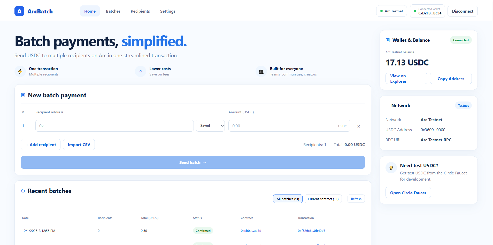
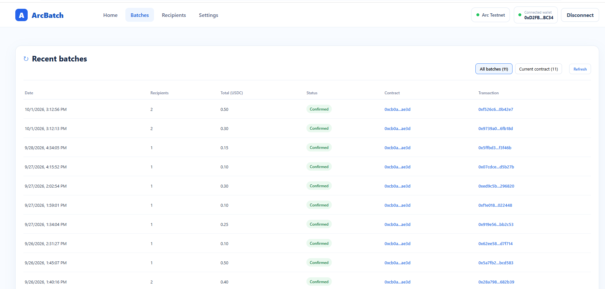
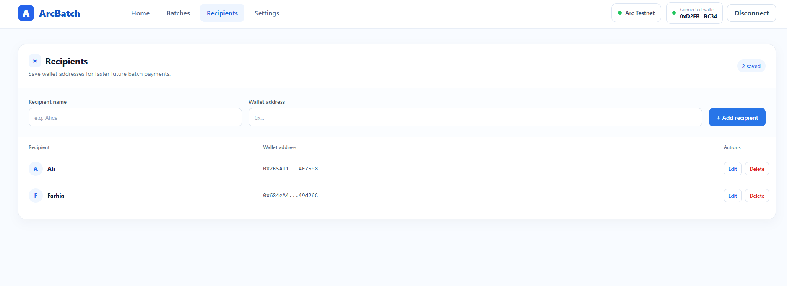
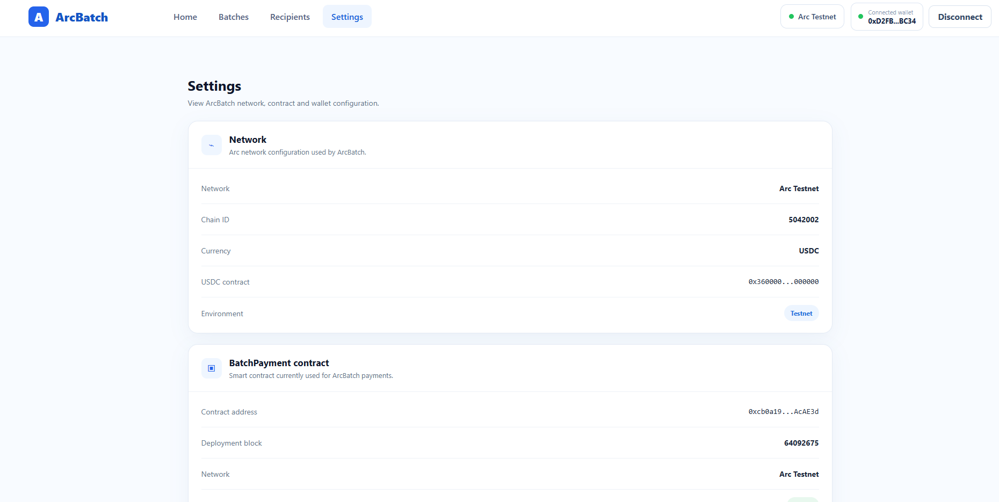

# ArcBatch

ArcBatch is a non-custodial batch USDC payment application built on the Arc Network Testnet.

It allows users to send USDC to multiple recipients in one blockchain transaction.

Built for hackathon submission.

---

## Live Demo

[https://arcbatch.vercel.app](https://arcbatch.vercel.app)

---

## Author

**Name:** Farhia Adam

 

---

## Overview

Sending payments to many people one by one is slow, repetitive, and inconvenient.

ArcBatch simplifies this process by allowing a user to:

- Connect a crypto wallet
- Add multiple recipients
- Enter USDC amounts
- Approve USDC
- Send all payments in one transaction
- View recent batch payment history

The application is designed for:

- Teams
- Communities
- Grant programs
- Creators
- Freelancers
- Organizations
- Payroll-style distributions

---

## Problem

Organizations and individuals sometimes need to send the same token to many recipients.

Normally, this requires creating separate blockchain transactions for every recipient.

For example:

```text
Recipient 1 → Transaction 1
Recipient 2 → Transaction 2
Recipient 3 → Transaction 3
Recipient 4 → Transaction 4
```

This creates:

- More manual work
- More wallet confirmations
- More transaction overhead
- More time spent processing payments

ArcBatch combines the recipients into one batch transaction.

```text
One transaction
      ↓
Recipient 1
Recipient 2
Recipient 3
Recipient 4
```

---

## Solution

ArcBatch uses a smart contract to process multiple USDC transfers atomically.

The user enters:

```text
Recipient address
Amount
```

for each recipient.

The frontend then calls:

```solidity
batchPay(address[] recipients, uint256[] amounts)
```

The smart contract transfers USDC from the sender directly to each recipient.

ArcBatch does not custody user funds.

---

## Main Features

### Batch USDC Payments

Send USDC to multiple recipients in one transaction.

### Dynamic Recipient Rows

Users can add or remove recipient rows dynamically.

### Saved Recipients

Users can save frequently used wallet addresses.

Saved recipients are currently stored in browser `localStorage`.

### CSV Import

Users can upload a CSV file containing recipients and amounts.

Example:

```csv
address,amount
0x123...,5
0x456...,10
0x789...,2.5
```

ArcBatch validates:

- Wallet addresses
- Amounts
- Duplicate addresses
- Maximum recipient count
- USDC decimal precision

### USDC Approval

ArcBatch checks the user's current allowance before sending the batch.

If approval is required, the user can approve the BatchPayment contract.

### Recent Batch History

ArcBatch displays recent batch payments including:

- Date
- Number of recipients
- Total USDC
- Transaction status
- Contract
- Transaction hash

### Resilient History Loading

ArcBatch normally attempts to retrieve history from Arcscan.

If Arcscan is unavailable, the application falls back to Alchemy RPC infrastructure.

This helps keep batch history available even when the explorer API is temporarily unavailable.

### Wallet Information

The application displays:

- Connected wallet
- Arc Testnet USDC balance
- Network status
- Explorer links

### Recipient Management

Users can:

- Add recipients
- Edit recipients
- Delete recipients
- Select saved recipients while creating a batch

### Settings

The Settings page displays:

- Network
- Chain ID
- USDC contract
- BatchPayment contract
- Deployment block
- Connected wallet

---

## Tech Stack

### Frontend

- React
- TypeScript
- Vite
- Wagmi
- Viem
- TanStack React Query
- CSS

### Smart Contract

- Solidity
- OpenZeppelin
- Foundry

### Blockchain

- Arc Network Testnet

### Token

- USDC

### RPC

- Alchemy Arc Testnet RPC

---

## Arc Testnet

### Chain ID

```text
5042002
```

### Network

```text
Arc Testnet
```

### USDC Contract

```text
0x3600000000000000000000000000000000000000
```

### USDC Decimals

```text
6
```

---

## Deployed BatchPayment Contract

```text
0xcb0a19E2F3c3abFdC74d612c54f55adD0cAcAE3d
```

Deployment block:

```text
64092675
```

Explorer:

```text
https://explorer.testnet.arc.io
```

---

## Smart Contract

The main smart contract is:

```text
contracts/src/BatchPayment.sol
```

The main function is:

```solidity
function batchPay(
    address[] calldata recipients,
    uint256[] calldata amounts
) external
```

The contract:

- Validates recipient arrays
- Prevents invalid recipient counts
- Transfers USDC directly from the sender
- Uses SafeERC20
- Uses ReentrancyGuard
- Processes the batch atomically
- Emits a BatchPaymentExecuted event

---

## Maximum Recipients

The current contract supports up to:

```text
100 recipients
```

per batch transaction.

---

## Non-Custodial Design

ArcBatch is non-custodial.

The application does not hold user funds.

The payment flow is:

```text
User wallet
    ↓
USDC allowance
    ↓
BatchPayment contract
    ↓
Recipients
```

Funds are transferred directly from the sender to the recipients during the transaction.

---

## Project Structure

```text
arcbatch/
│
├── src/
│   ├── components/
│   ├── config/
│   ├── contracts/
│   ├── hooks/
│   ├── services/
│   ├── types/
│   ├── App.tsx
│   └── App.css
│
├── contracts/
│   ├── src/
│   │   └── BatchPayment.sol
│   ├── test/
│   └── foundry.toml
│
├── public/
├── package.json
└── README.md
```

---

## Local Development

### Requirements

Install:

- Node.js
- npm or pnpm
- MetaMask
- Foundry for smart contract development

---

## Install Dependencies

Clone the repository:

```bash
git clone https://github.com/Farxiya4Fiican/arcbatch
```

Open the project:

```bash
cd arcbatch
```

Install dependencies:

```bash
npm install
```

or:

```bash
pnpm install
```

---

## Environment Variables

Create:

```text
.env.local
```

Add:

```env
VITE_ALCHEMY_API_KEY=YOUR_ALCHEMY_API_KEY
```

Do not commit your real `.env.local` file.

---

## Run the Frontend

```bash
npm run dev
```

or:

```bash
pnpm dev
```

Then open:

```text
http://localhost:5173
```

---

## Build

```bash
npm run build
```

or:

```bash
pnpm build
```

---

## Smart Contract Development

Go to the contract folder:

```bash
cd contracts
```

Run tests:

```bash
forge test
```

The BatchPayment contract includes tests for:

- Successful batch payments
- Invalid recipients
- Invalid amounts
- Maximum recipients
- Allowance handling
- Atomic transaction behavior

---

## How to Use ArcBatch

### 1. Connect Wallet

Connect MetaMask to Arc Testnet.

### 2. Get Test USDC

Use the Circle faucet to obtain Arc Testnet USDC.

### 3. Add Recipients

Enter recipient wallet addresses and amounts.

You can also:

- Select saved recipients
- Import recipients using CSV

### 4. Approve USDC

If required, approve the BatchPayment contract to spend the required amount of USDC.

### 5. Send Batch

Click:

```text
Send batch
```

Confirm the transaction in MetaMask.

### 6. View History

After confirmation, the transaction will appear in Recent Batches.

---

## CSV Format

Example:

```csv
address,amount
0x1111111111111111111111111111111111111111,5
0x2222222222222222222222222222222222222222,10
```

Required columns:

```text
address
amount
```

---

## Validation

ArcBatch validates:

- Ethereum-compatible addresses
- Positive amounts
- Duplicate recipients
- USDC decimal precision
- Recipient limit
- Empty rows
- Invalid CSV structure

---

## Batch History Architecture

ArcBatch uses two history sources.

Primary:

```text
Arcscan API
```

Fallback:

```text
Alchemy RPC
```

Flow:

```text
Arcscan
   ↓
Available?
   ↓
Yes → Load history

No
   ↓
Alchemy fallback
   ↓
Load wallet transactions
   ↓
Decode batchPay()
   ↓
Display history
```

This improves reliability when one external service becomes unavailable.

---

## Security

ArcBatch uses several security practices.

### Non-Custodial

The application never stores user funds.

### SafeERC20

OpenZeppelin SafeERC20 is used for USDC transfers.

### ReentrancyGuard

The payment function is protected against reentrancy.

### Atomic Batch

If one transfer fails, the entire transaction reverts.

### Maximum Batch Size

The contract limits batches to 100 recipients.

### No Private Keys

ArcBatch never requests or stores wallet private keys.

Wallet signing is handled by MetaMask.

---

## Current MVP Storage

Saved recipients are stored using:

```text
localStorage
```

This keeps the hackathon MVP simple and does not require a backend database.

A future version could synchronize recipients using a cloud database.

---
## Screenshots

### Home



### Recent Batches



### Recipients



### Settings



---

## Future Improvements

Possible future improvements include:

- Cloud recipient synchronization
- Multiple token support
- Multiple Arc networks
- Batch templates
- Scheduled payments
- Team accounts
- Role-based access
- Payment labels
- Export transaction history
- Advanced analytics
- Recipient groups
- Gas estimation
- Batch duplication

---

## Hackathon MVP Status

Implemented:

- Wallet connection
- Arc Testnet integration
- USDC balance
- Dynamic recipients
- Saved recipients
- CSV import
- USDC approval
- Batch payments
- Smart contract deployment
- Smart contract tests
- Recent transaction history
- Arcscan integration
- Alchemy fallback
- Recipient management
- Settings page
- Responsive layout
- End-to-end testing

---

## Contract Address

```text
0xcb0a19E2F3c3abFdC74d612c54f55adD0cAcAE3d
```

---

## Author

**Farhia Adam**

Newfarxiya@gmail.com

Software Developer

---

## License

MIT
